# Machine Learning with Google Cloud Platform with AutoML and VertexAI

Hello everyone today I want to discuss something interesting about  **how to create an automatic Machine Learning model** by using the AutoML feature that provides Google Cloud Platform.  

Let us assume that you have one dataset which you should create a machine learning model, **you don't have too much time to think** which model to use and you need to **create a machine learning model** asap.  Fortunately your company give you the possibility to use the cloud resources of Google. 

Then for this special case, you can can use the **AutoML with Vertex AI.**

To illustrate how to create a machine learning model with few clicks , I will  take an example of  public dataset of Fraud Detection,  and we will create a binary classification by using the AutoML. In similar way you can use to another types of ML models that I will discuss during this blog post.

## Step 1 - Activate Cloud Shell

First we login into our console of  Google Cloud Platform (GCP) account 

[https://cloud.google.com](https://cloud.google.com)


Then after you login to your Cloud Console  in the top right toolbar, to launch Notebooks with Vertex AI.

## Step 2 Enable the Vertex AI API

Click on the **Navigation Menu** and navigate to **Vertex AI**, then click **Vertex AI > Dashboard**, and then click **Enable Vertex AI API**.

- 

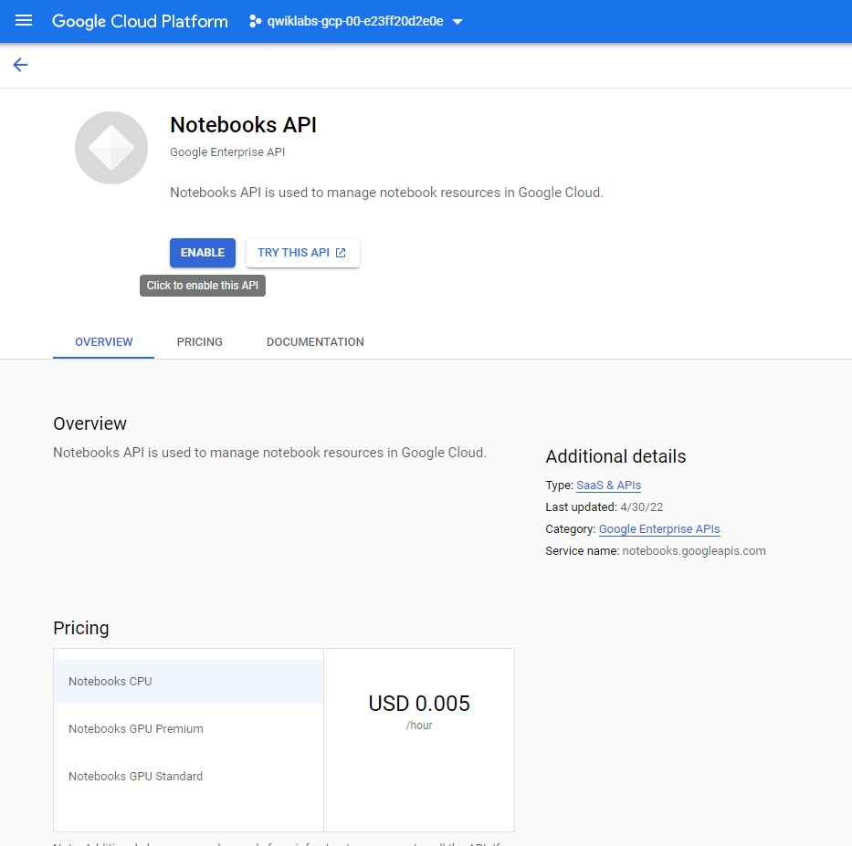

## Step 2 Create a Notebooks instance

1. Still on the Vertex AI page, in the left menu click on **Workbench**.

2. On the Notebook instances page, click **New Notebook > Python 3**.

   

3. In the **New notebook instance** dialog, use the default settings, then click **Create**. The new VM will take 2-3 minutes to start.

   

4. Click **Open JupyterLab**. A JupyterLab window will open in a new tab.

   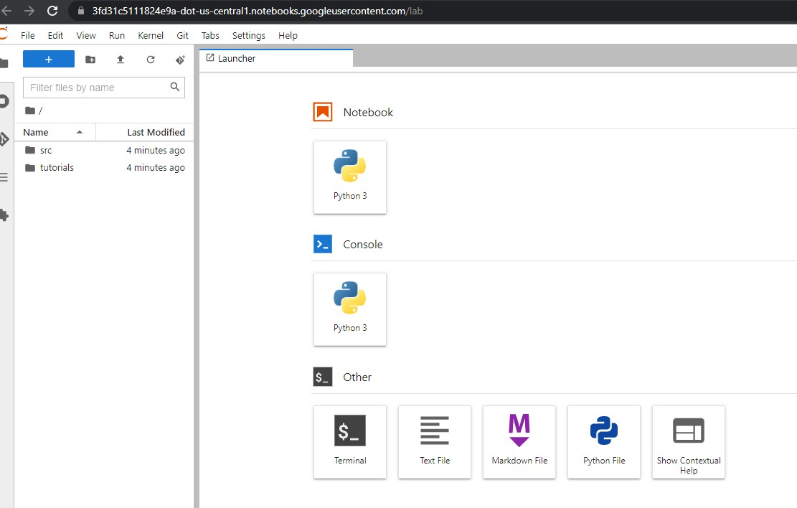


With this notebook you can open Python 3 and load the endpoint of your machine learning  model that  you will create in the next section.


# Step 3 - Creation of the Machine Learning model

In **Vertex AI**, you can create managed datasets for a variety of data types. You can then generate statistics on these datasets and use them to train models with AutoML or use your own custom model code.


1. In the Vertex AI navigation menu, click **Datasets**.

   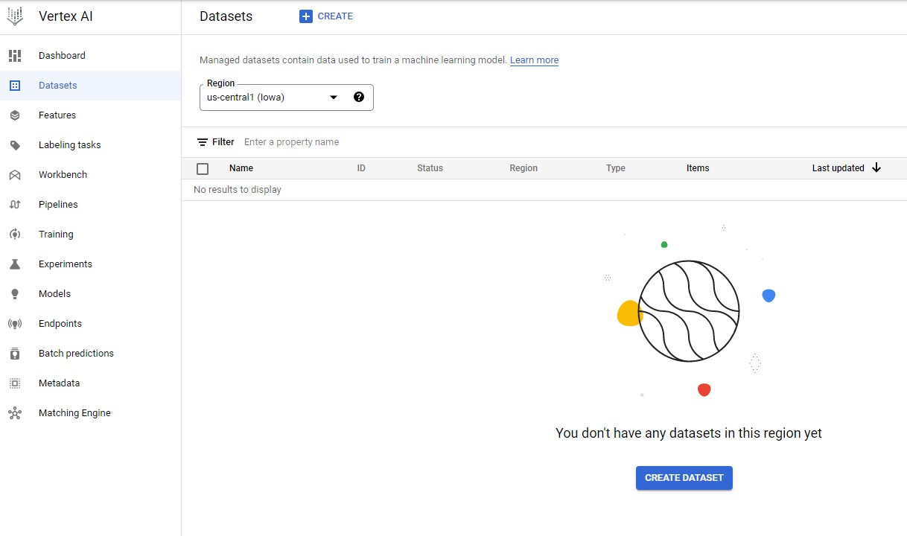

2. Click **Create dataset**. For **Dataset name**, type a name like `fraud_detection`.


## Types of Machine Learning Models for VertexAI

There are different machine learning models that can be **handled by Google Cloud Platform**, 

**For Images**

- Image Classification ( Single-Label)
- Image Classification ( Multi-Label)
- Image Object detection
- Image Segmentation


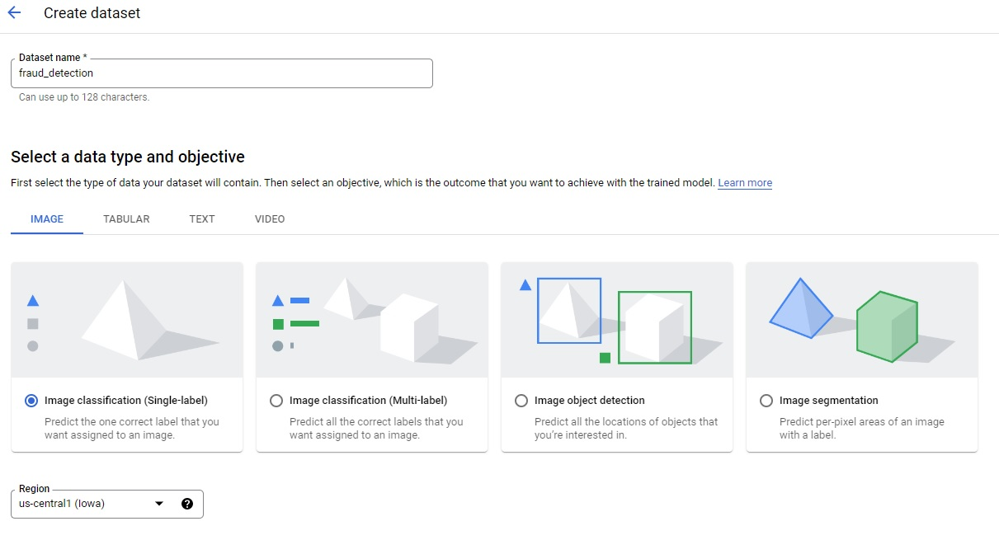

**For tabular data**

- Regression/Classification
- Forecasting

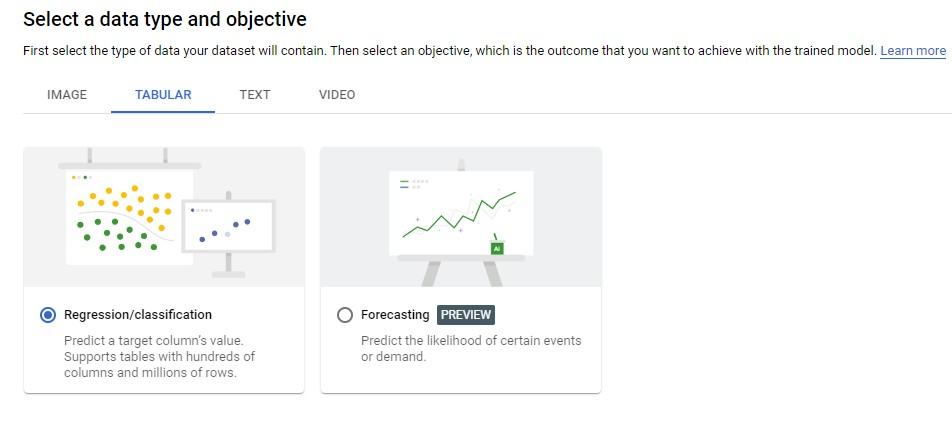


**For text data**

- Text Classification ( Single-Label)
- Text Classification ( Multi-Label)
- Text entity extraction
- Text sentiment analysis


**For video**

- Video action recognition
- Video classification
- Video object tracking

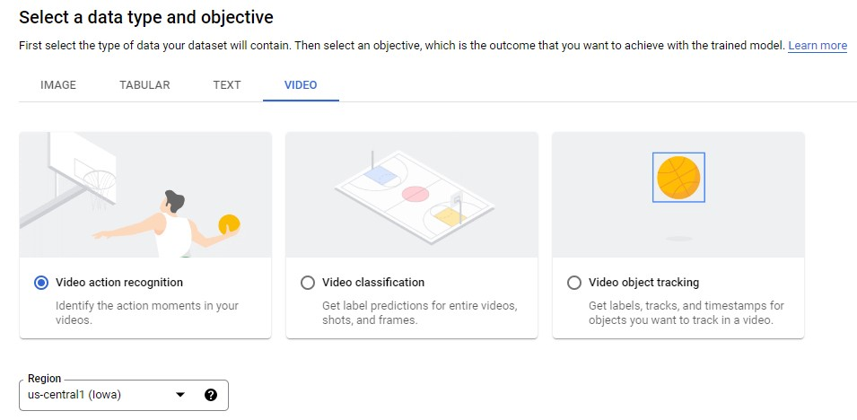

Depending  the type of data of your dataset will contain. Then we need  to select an objective, which is the outcome that you want to achieve with the trained mode


## Step 4. Selection of the Machine Learning case

For this blog post project we choose the the **Tabular** data type, and then select **Regression/classification**.

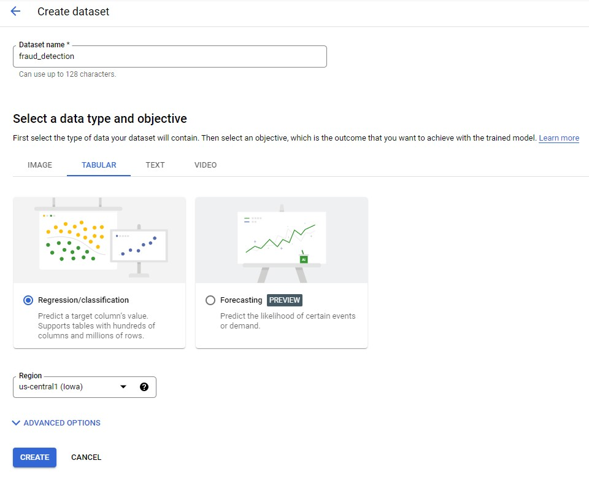

and we click **Create**.


### Step 5. Import data from BigQuery

In the created dataset, there are a few options for importing data to managed datasets in Vertex. 


You can:

- Upload CSV files from your computer.
- Select CSV files from Cloud Storage.
- Select a table or view from BigQuery.

For this lab you will upload data from a public BigQuery table.

1. On the Add data to your dataset page, for Select a data source, choose **Select a table or view from BigQuery**.

   

   For the BigQuery path, add the following:

```
bigquery-public-data.ml_datasets.ulb_fraud_detection
```

then Click **Continue**.

Your result should look similar to this image:


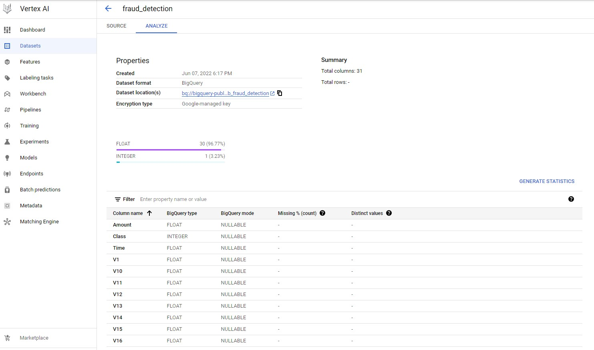


To see additional information about this dataset, click **Generate statistics**. This dataset contains real credit card transactions. Most of the column names have been obscured, which is why they are called *V1*, *V2*, etc.

## Step 6. Train a model with AutoML

With a managed dataset uploaded, you are ready to train a model with this data. You will train a classification model to predict whether a specific transaction is fraudulent. Vertex AI gives you two options for training models:

- **AutoML:** Train high-quality models with minimal effort and ML expertise.

- **Custom training:** Run your custom training applications in the cloud by using one of Google Cloud's pre-built containers or your own.

  

In this lab, use AutoML for training.

### Start the training job

1. On the dataset detail page, on the right side, click **Train new model**.

   

2. For **Objective**, select **Classification**, and then select **AutoML**.

3. Click **Continue**.

   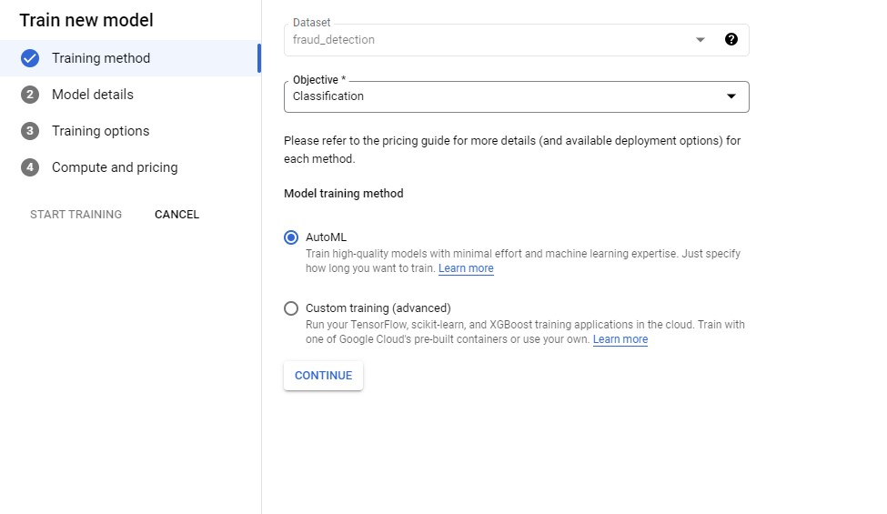

Under **Advanced options** you can specify a train/test split if you don't want Vertex to handle this automatically. For this lab you use random assignment, but you can also specify this manually when you upload a CSV of your data, or you can have the data split chronologically if it has a Time column.

1. Under **Model details**, for **Target column**, select **Class (INTEGER)**. The integer indicates whether a particular transaction was fraudulent (0 for non-fraud, 1 for fraud).

2. Click **Continue**.

   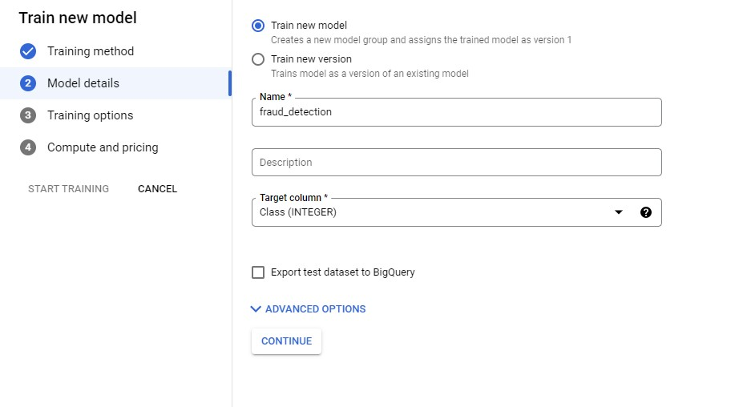

3. Scroll down the page and click **Advanced options**.

4. For **Optimization objective**, select **AUC PRC**. Because this dataset is heavily imbalanced (less than 1% of the data contains fraudulent transactions), this option maximizes precision-recall for the less common class.

5. Click **Continue**.

   

6. For **Budget**, type **1**, and leave early stopping enabled. Training your AutoML model for 1 compute hour is typically a good start for understanding whether there is a relationship between the features and label you've selected. From there, you can modify your features and train for more time to improve model performance.

Training will take slightly longer than two hours to account for time to spin up and tear down resources.

If you want to spend money you can click Click **Start training**.


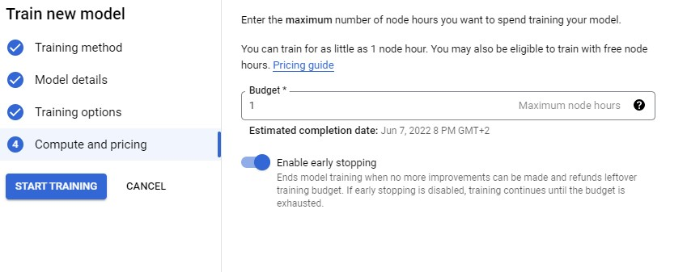

##  Step 7. Vertex AI  Models

Once the model has been successfully trained, you can see a custom trained model if you head to **Vertex AI** ➞ **Models**


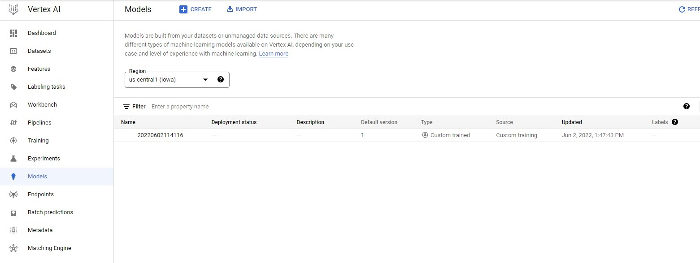

## Step 7 Deploy the model

Before you use your model to make predictions, you need to deploy it to an `Endpoint`. You can do this by calling the `deploy` function on the `Model` resource. This will do two things:

1. Create an `Endpoint` resource for deploying the `Model` resource to.
2. Deploy the `Model` resource to the `Endpoint` resource.

### Endpoint

In order to view your deployed endpoint, you can head over to **Vertex AI** ➞ **Endpoints**


You can check if your endpoint is in the list of the currently deployed/deploying endpoints.

To view the details of the endpoint that is currently deploying, you can simply click on the endpoint name.

Once deployment is successfull, you should be able to see a green tick next to the endpoint name 

## Step 8 Make a prediction request

Send an online prediction request to your deployed model.

```

AUTH_TOKEN = 'REPLACE_WITH_YOUR_TOKEN'

data = '{"endpointId": "2416330733665648640","instance": "[{Time: 80422,Amount: 17.99,V1: -0.24,V2: -0.027,V3: 0.064,V4: -0.16,V5: -0.152,V6: -0.3,V7: -0.03,V8: -0.01,V9: -0.13,V10: -0.18,V11: -0.16,V12: 0.06,V13: -0.11,V14: 2.1,V15: -0.07,V16: -0.033,V17: -0.14,V18: -0.08,V19: -0.062,V20: -0.08,V21: -0.06,V22: -0.088,V23: -0.03,V24: 0.01,V25: -0.04,V26: -0.99,V27: -0.13,V28: 0.003}]"}'

import requests
headers = {
    'Content-type': 'application/json',
    'Authorization': 'Bearer ' + AUTH_TOKEN
}
response = requests.post('https://sml-api-vertex-kjyo252taq-uc.a.run.app/vertex/predict/tabular_classification', headers=headers, data=data


```

Add a cell in your notebook to print the prediction results:

```
print(response.json())
```

## Step 9 Cleaning up

To clean up all Google Cloud resources used in this project, you can [delete the Google Cloud project](https://cloud.google.com/resource-manager/docs/creating-managing-projects#shutting_down_projects) you used for the tutorial.

Otherwise, you can delete the individual resources you created in this tutorial:

- Training Job
- Model
- Endpoint

To delete the notebook entirely, click **Delete**.

To delete the endpoint you deployed, in the **Endpoints** section of your Vertex AI console, click **Delete**. Then, click **Undeploy**.

To remove the endpoint, click the overflow menu.. Then click **Remove endpoint**.

To delete the Cloud Storage bucket, on the **Cloud Storage** page, select your bucket, and then click **Delete**.


**Congratulations!**   You have used Vertex AI to train and serve a model with tabular data. You have build a fraud detection model to determine whether a particular credit card transaction should be classified as fraudulent.
